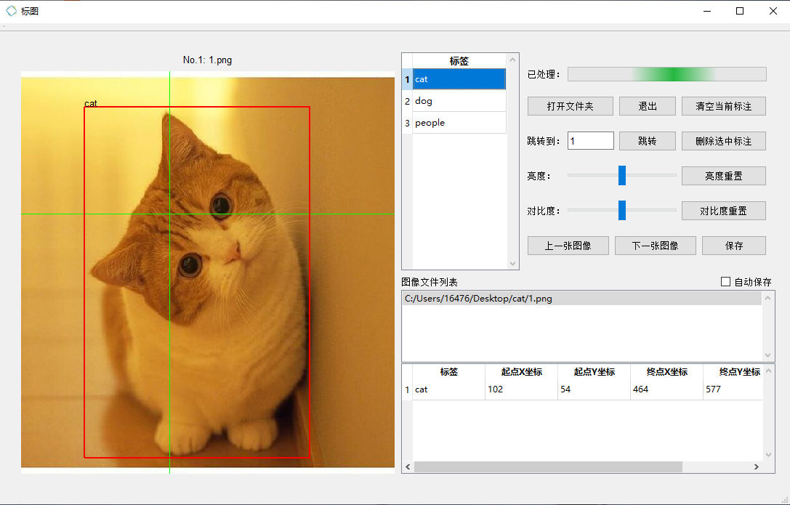
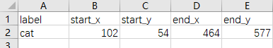
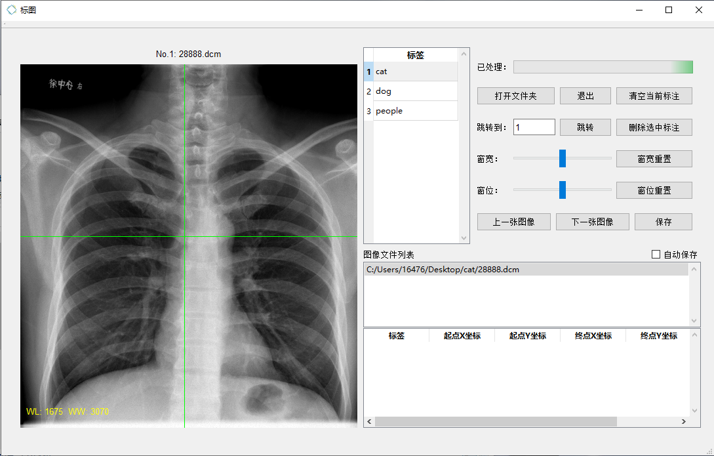

# Plotting software
## Introduce
  The softward of label picture boxes, supported image type including png、jpg、jpeg、dcm. By modifying **labelmap.csv** in the directory to modify the labels. This is compiled software,
want to know the source code please click [here.](https://github.com/qiangw21/plot)

---
## Interface

---
## Function
### Annotation Image Type
- jpg、png、jpeg、dcm
### Shortcut_Key: 
- ctrl+s: save
- w or left: previous image
- s or right: next image
- up、down: switch labeled box
- delete: delete checkbox
- ctrl+0: restore image size
### Mouse operation
- Change the box's size  
Select the box, and the left mouse button drag the border to resize. Right click to deselect.  

- The mouse wheel scale the image. Right mouse button to move the image.
- Change the box's label  
Select the Box, and then choice the label of labellists than you want to change.
### Save type
- .csv  
Pre image is saved as a csv file.  

## Support Dicom
